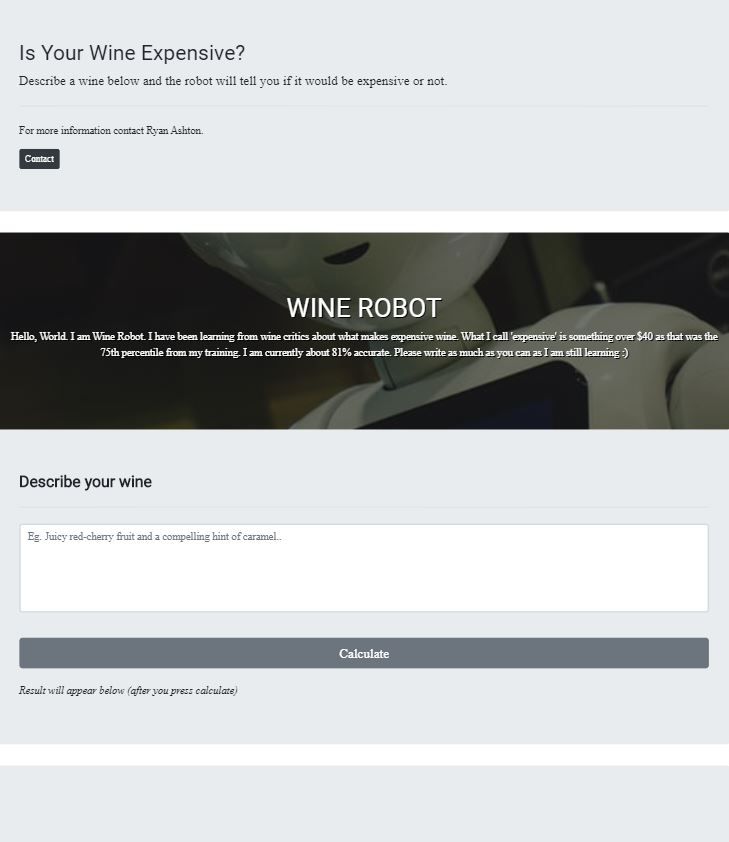

# ML_App

This is a small project which aims to test whether a user knows about expensive wine or not!

The user will type in a descrption of a wine, similar to how a wine critic would describe it. 

The Wine Robot will then determine if it is an expensive wine or not... An expensive wine in this case is in the 90th percentile of all wine reviews the Wine Robot has been trained on.

The contributors to this project is:

- Ryan Ashton

Current Look (To be updated):

